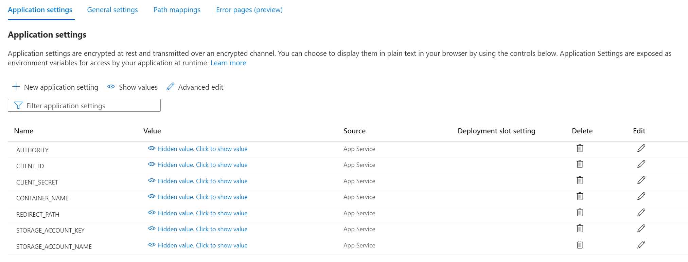

## Overview 
This application shows all the photos uploaded to a storage account and lets you create new folders and upload photos/videos to have a rich collection of your memories.

The application uses authentication mechanism and also ensures that public access is not allowed on containers and blobs, so no one can see these memories unless they are authroized to.

## Pre-requisites
1. Azure storage account with heirarchical namespace.
2. This web app should be deployed to Azure web app. See [Deployment](#deployment) section for details.
3. An AAD application required for authentication with Redirect URI defined. 
    - For testing in local, define `http://localhost:8000/authorized`
    - For Azure web app, define `https://<app url>/authorized` 
4. The user should be added/invited in respective Azure Tenant.

That's it. 

## How does it work?
- Use this web app to create desired folders and upload photos/videos. 
- Browse your memories through this easy user interface.

## Technical Details 
The backend of this applicaiton is Python FastAPI framework and front-end is a HTML file with jinja2 template. The focus is to create an application that has the functionality to view and upload images with security features with very basic aesthetics. 

**Features**:
- MSAL authentication using Authorization code
- Silent login supported for better user experience
- Storage container is kept private and a SAS with 24 hour validity is generated to view the images. Re-login to the app creates a new SAS with 24-hour validity.
- Supports view and upload photos. Intentionally, the functinoality to delete photos is not provided.
- The parameters can be taken from web app environment or using app_config file with app environment as the first priority. Recommend to store client app secret and storage account key only in web app environment due to their sensitive nature.


## Deployment
**Follow below steps to run the application in local**:

- Ensure you have Python 10 or higher installed. 
- Please create a virtual env with below command and activate it.
 ```
 python -m venv venv
 ```
- Install the packages mentioned in requirements file using below command.
 ```
 pip install -r requirements.txt
 ```
- Update below parameters in **app_config.py** file
1. STORAGE_ACCOUNT_NAME
2. CONTAINER_NAME
3. STORAGE_ACCOUNT_KEY
4. CLIENT_ID
5. CLIENT_SECRET
6. AUTHORITY : << Update with your Tenant Id >>
7. REDIRECT_PATH

- Run this command to start the application:
```
uvicorn main:app --reload
```
- You can access this application now with any browser using this link: `localhost:8000`

**Follow below steps to deploy application in Azure**:

In Azure web app, use deployment center to link to Git and deploy this application. 

Azure web app supports WSGI standard (Gunicorn as an application server), and FastAPI uses superior ASGI. But Gunicorn supports working as a process manager with Gunicorn-compatible Uvicorn worker class. Use this startup command in Azure web app to bind gunicorn to Uvicorn worker class:
```
gunicorn -w 1 -k uvicorn.workers.UvicornWorker app:app
```
Note that *'-w 1'* mentions the number of workers to be used. This number can be updated if we want to start multiple workers depending on the application workload.

Ensure that you put sensitive parameters like STORAGE_ACCOUNT_KEY and CLIENT_SECRET only in *Azure web app > Configuration > Application Settings*.




